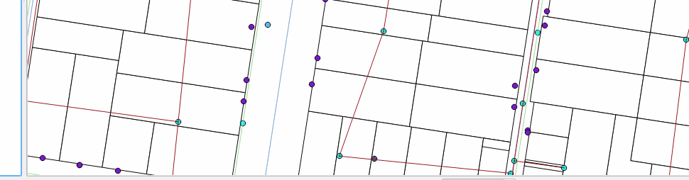

# QGIS Command Bar

A simple to use interactive command bar for QGIS. Commands are defined in Python and may take arguments. 

All functions are interactive and if not all arguments are given will prompt for each one as required.



Download the plugin from the QGIS plugin repo or from [http://plugins.qgis.org/plugins/qgiscommand/](here)

Inspiration for the command bar was drawn from AutoCAD and Emacs, so you might
find things that feel the same - or at least an attempt to.

## Usage

The command bar is designed to be a simple interactive command window, using
`CTRL ,` will open the command bar at the bottom of you QGIS map canvas ready to
type. The first auto complete will show all the functions that have been defined
and typing will filter the list.

**Tip**: The auto complete is fuzzy matched so you can type any letters in order
and it will filter based on each leter not the exact pattern.  Try it.

## Init file

The `init.qgsc` file is loaded from `qgis2\python\commandbar` when QGIS is fully
loaded, after all plugins have been loaded.

Commands in the init file need to be wrapped in `()` in order to be considered
commands.  Here is an example of defining aliases for commands you might use all
the time.

```lisp
(alias pt point-at)
(alias lp load-project)
(alias move feature-move)
```

You can also define a single command over many lines like so:

```lisp
(define-project-paths '/home/user/gisdata'
                      '/home/user/projects')
```

## API

Follow the API guide in order to create you own commands.  Commands can also be
defined in plugins to add plugin functions to the command bar.

User commands can be created in `.qgis\python\commandbar` by following Adding
User commands guide
