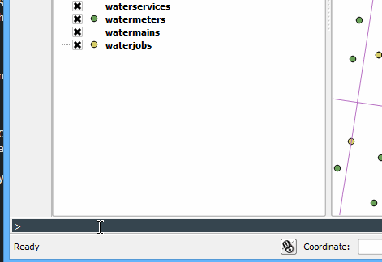

# QGIS Command Bar

Are you pining for the good old MicroStation command line? Love the AutoCAD style data entry? Or really who needs a mouse anyway.
The QGIS Command Bar plugin has your back.

## What the heck is this?

A simple to use interactive command bar for QGIS. A bit like Emcas command line, or the AutoCAD one, or whatever it
evolves into. 

Because Python is so bloody great new commands can be defined in Python with normal functions.
All functions are interactive and if not all arguments are given will prompt for each one as required.

Pro Tip: Type `define-package yourpackagename` to open a new package in your text editor. `reload-packages` to load it

Download the plugin from the QGIS plugin repo orfrom [http://plugins.qgis.org/plugins/qgiscommand/](here) and hit `CTRL + ,` to give the
bar focus.

Here is an example of using `rename-layers` to rename layer names using regex find and replace.

I said it was interactive so here it is asking a question

## Why even build something like this?

I have used AutoCAD in the past, and now use [Emacs and Vim](https://github.com/syl20bnr/spacemacs) as my editor, they all have
cool command line style interfaces.  Sure QGIS has the Python console but it's not quite the same. The Python console
can't ask you questions while running a function, it's all or nothing when calling a function.

Inspiration for the command bar was drawn from AutoCAD and Emacs, so you might
find things that feel the same - or at least an attempt to.

## Usage

As the command bar is designed to be a simple interactive command window, using
`CTRL ,` will open the command bar at the bottom of you QGIS map canvas ready to
type. The first auto complete will show all the functions that have been defined
and typing will filter the list.

**Tip**: The auto complete is fuzzy matched so you can type any letters in order
and it will filter based on each leter not the exact pattern.  Try it.

## API

What is even the point of a tool like this if you can't extend it.  Well there is
a API for that.  Follow the API guide in order to create you own commands.

Another cool little trick is that commands can also be
defined in plugins to add plugin functions to the command bar.

Here is a demo of adding a plugin based `az-vertex` command that is loaded from a plugin.

Strat by using `define-package` followed by `reload-packages`. User commands are
reloaded when the plugin starts ready to go

## BUGZ!

So I develop this in my free time and so there is bound to be bugs.  Hopefully I can
keep the core simple enough to reduce the number but no doubt you are going to find some.

If you do report [them](https://github.com/NathanW2/qgiscommand/issues) please.  If you have
the skills the fix the bugs I am very open to pull requests.
